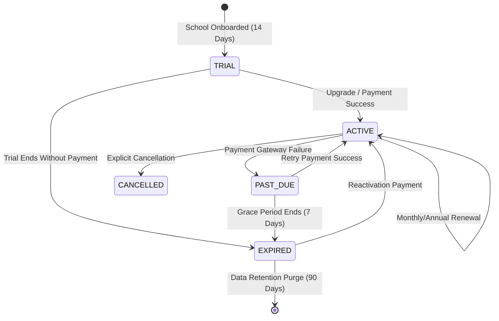

# SchoolOS — Subscription Plans, Restrictions & Plan Validity Guide

This document defines the official product specifications, tier restrictions, enforcement architecture, plan validity lifecycles, and free trial functionality for the **SchoolOS** multi-tenant SaaS platform.

---

## 1. Overview & Business Model

SchoolOS operates as a B2B SaaS subscription platform designed for educational institutions across India and emerging markets. It employs a **Freemium & Tiered Subscription Model** tailored to institution size:

- **Self-Serve Trials & Freemium**: Frictionless onboarding for micro-schools and coaching centers.
- **Predictable Tiered Pricing**: Fixed monthly/annual SaaS pricing indexed by student body capacity, teaching staff seats, and advanced operational modules.
- **Enterprise Customization**: White-label subdomains, dedicated database isolation, and custom multi-branch rollouts.

---

## 2. Subscription Tiers & Feature Matrix

| Feature / Limit                 | Free Tier (`FREE`)        | Basic Plan (`BASIC`)             | Pro Plan (`PRO`)                  | Enterprise (`ENTERPRISE`)         |
| :------------------------------ | :------------------------ | :------------------------------- | :-------------------------------- | :-------------------------------- |
| **Target Audience**             | Coaching centers & trials | Primary & Middle schools         | Established K-12 schools          | School networks & chains          |
| **Pricing (Monthly)**           | **₹0** / month            | **₹999** / month                 | **₹2,499** / month                | **₹4,999** / month                |
| **Pricing (Annual)**            | **₹0** / year             | **₹9,990** / year _(2 mos free)_ | **₹24,990** / year _(2 mos free)_ | **₹49,990** / year _(2 mos free)_ |
| **Active Students**             | Max **50** students       | Max **200** students             | Max **1,000** students            | **Unlimited**                     |
| **Teaching Staff**              | Max **5** teachers        | Max **20** teachers              | Max **100** teachers              | **Unlimited**                     |
| **Active Classes**              | Max **5** classes         | Max **20** classes               | Max **60** classes                | **Unlimited**                     |
| **Daily Attendance**            | ✅ Included               | ✅ Included                      | ✅ Included                       | ✅ Included                       |
| **Assignments & Notices**       | ✅ Included               | ✅ Included                      | ✅ Included                       | ✅ Included                       |
| **Fee Management**              | Basic Receipts            | Class Fee Structures             | Automated Invoicing & Dues        | Multi-session Ledger              |
| **Examinations & Report Cards** | ❌ None                   | ❌ None                          | ✅ CBSE 9-Point & Percentage      | ✅ Custom Grading Schemes         |
| **Timetable Generator**         | ❌ None                   | ❌ None                          | ✅ Auto Constraint Solver         | ✅ Multi-Branch Matrix            |
| **Transport & Fleet**           | ❌ None                   | ❌ None                          | ✅ Routes, Stops, Invoicing       | ✅ Custom GPS & Manifests         |
| **Advanced Analytics**          | ❌ Disabled               | ❌ Disabled                      | ✅ Cohorts & Cash Flows           | ✅ Multi-Branch Benchmarks        |
| **Online Payment Gateway**      | ❌ None                   | ❌ None                          | ✅ Razorpay / UPI Integration     | ✅ Dedicated Merchant ID          |
| **Custom Branding**             | ❌ SchoolOS Badge         | ❌ SchoolOS Badge                | ❌ Standard Subdomain             | ✅ Custom Domain & Logo           |
| **Support SLA**                 | Community                 | Email (24-hour SLA)              | Priority Chat & Phone             | Dedicated Account Mgr (99.9%)     |

---

## 3. Plan Restrictions & Enforcement Architecture

### 3.1 Database Representation

The limits are modeled via the `PlanLimit` entity in `schema.prisma` with fallback values defined in application code:

```prisma
model Subscription {
  id                 String             @id @default(cuid())
  schoolId           String             @unique
  plan               SubscriptionPlan   @default(FREE)
  status             SubscriptionStatus @default(TRIAL)
  trialEndsAt        DateTime?
  currentPeriodStart DateTime?
  currentPeriodEnd   DateTime?
  cancelledAt        DateTime?
  cancelReason       String?
  createdAt          DateTime           @default(now())
  updatedAt          DateTime           @updatedAt
  school             School             @relation(fields: [schoolId], references: [id], onDelete: Cascade)

  @@map("subscriptions")
}

model PlanLimit {
  id               String           @id @default(cuid())
  plan             SubscriptionPlan @unique
  maxStudents      Int
  maxTeachers      Int
  maxClasses       Int
  analyticsEnabled Boolean          @default(false)
  customBranding   Boolean          @default(false)
  prioritySupport  Boolean          @default(false)

  @@map("plan_limits")
}
```

### 3.2 Server-Side Quota Enforcement Guardrails

Resource creation mutations (`createStudent`, `createTeacher`, `createClass`, batch CSV imports) are guarded at the server-action level in `apps/admin-web/src/lib/plan-limits.ts`:

```typescript
// Student Quota Enforcement
export async function checkStudentLimit(
  schoolId: string,
): Promise<{ allowed: boolean; current: number; max: number; plan: string }> {
  const school = await prisma.school.findUnique({
    where: { id: schoolId },
    select: {
      plan: true,
      _count: { select: { students: { where: { isActive: true } } } },
    },
  });
  if (!school) return { allowed: false, current: 0, max: 0, plan: "FREE" };

  const limits = await getPlanLimits(school.plan);
  const current = school._count.students;
  return {
    allowed: current < limits.maxStudents,
    current,
    max: limits.maxStudents,
    plan: school.plan,
  };
}
```

- **Active-Only Count**: Inactive/archived students or past teachers do not count against the school's licensed quota.
- **Fail-Safe Fallbacks**: If the `PlanLimit` database row is temporarily unavailable, static fallback constants ensure uninterrupted service while continuing to protect platform resources.
- **User-Facing Feedback**: When an administrator attempts to exceed a quota, the API responds with a descriptive message prompting an upgrade:
  > _"You've reached the FREE plan limit of 50 students. Upgrade your plan to add more."_

---

## 4. Plan Validity & Subscription Lifecycle

### 4.1 State Machine

Each school's subscription progresses through the following finite lifecycle states:



### 4.2 Status Definitions & System Behavior

| Subscription Status | Definition                                                                                 | Access Level                                                         | Administrative Action Required                     |
| :------------------ | :----------------------------------------------------------------------------------------- | :------------------------------------------------------------------- | :------------------------------------------------- |
| **`TRIAL`**         | Initial 14-day onboarding window.                                                          | **Full Pro Suite** enabled.                                          | Upgrade before `trialEndsAt`.                      |
| **`ACTIVE`**        | Paid subscription within valid billing cycle (`currentPeriodStart` to `currentPeriodEnd`). | Standard tier entitlements based on `plan`.                          | Automated monthly/annual invoice generation.       |
| **`PAST_DUE`**      | Recurring billing card failed or payment is pending.                                       | **Full access** during 7-day grace period; warning banner displayed. | Update billing details or complete payment.        |
| **`EXPIRED`**       | Trial ended or grace period expired without payment.                                       | **Restricted / Read-Only** or redirected to `/suspended`.            | Choose plan to restore full administrative access. |
| **`CANCELLED`**     | Explicitly terminated by school admin or super admin.                                      | Access active until end of current billing cycle; then suspended.    | Contact support to reactivate.                     |

### 4.3 Validity Window Calculation

- **Monthly Billing**: `currentPeriodEnd = currentPeriodStart + 1 Month`
- **Annual Billing**: `currentPeriodEnd = currentPeriodStart + 1 Year`
- **Grace Period**: 7 calendar days added following failed renewal before changing status to `EXPIRED`.
- **System Route Guard**: If `school.isActive === false` or status is `EXPIRED`, the Next.js layout redirects unauthenticated/expired routes to `/suspended` or `/subscriptions/upgrade`.

---

## 5. Free Trial Functionality

### 5.1 Trial Initialization

When a new school registers:

1. A `School` record is created with default plan set to `PRO` (or `FREE` in manual mode).
2. A `Subscription` record is automatically inserted with:
   - `status`: `"TRIAL"`
   - `trialEndsAt`: `now() + 14 days`
   - `currentPeriodStart`: `now()`
   - `currentPeriodEnd`: `now() + 14 days`
3. No credit card or upfront financial commitment is required to start the trial.

### 5.2 In-App Trial Indicators

- **Days Remaining Banner**: A prominent countdown badge in the top navigation bar displays:
  - _Days 1–10_: _"Trial Active: X days remaining."_ (Neutral/Violet)
  - _Days 11–14_: _"Trial Expiring Soon: X days remaining — Upgrade Now."_ (Amber)
  - _Day 14+_: _"Trial Expired — Select a Plan to continue."_ (Red)

### 5.3 Post-Trial Policy Options

When a 14-day trial concludes without entering payment details, the system supports two configurable operational policies:

1. **Graceful Downgrade to Free Tier (Default)**:
   - Plan is updated to `FREE`.
   - If current active student count exceeds 50, existing records remain accessible in **read-only mode**, but adding new students/classes is locked until either records are archived or an upgrade is purchased.
2. **Account Suspension**:
   - Access to management routes is temporarily locked behind an upgrade checkout screen, preserving all school data for 90 days.

---

## 6. Super Admin Plan Management & Overrides

Super Administrators (`SUPER_ADMIN`) have comprehensive global control via `/subscriptions`:

- **1-Click Plan Switching**: Upgrade or downgrade any school instantly without requiring payment gateway callbacks.
- **Custom Quota Overrides**: Ability to adjust `maxStudents` or `maxTeachers` individually for special partner institutions.
- **Manual Offline Payments**: Recording offline wire transfers (NEFT/RTGS/Cheque) to mark subscriptions `ACTIVE` with custom expiry dates.
- **Subscription Audit Log**: Complete history of plan transitions, payment identifiers, and cancellation reasons.
